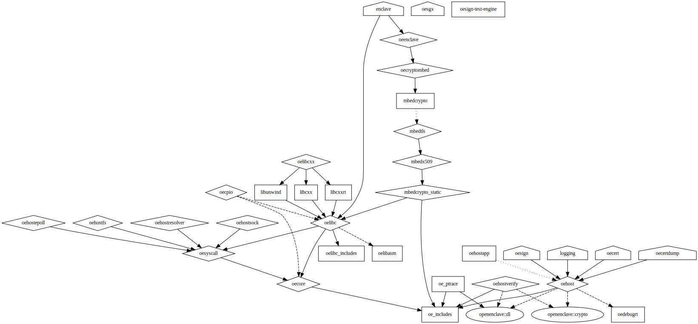

# Advanced Build Information

## Installing CMake

This project requires at least [CMake 3.13.1](https://cmake.org/download/). This
is probably not available in your package manager's repositories, but we use the
`OBJECT` library feature extensively, so you need to install it either manually
from their website, or with our Ansible scripts:

```bash
cd openenclave/scripts/ansible
ansible localhost -m import_role -a "name=linux/openenclave tasks_from=environment-setup.yml" --become --ask-become-pass
```

## CMake Configuration

In addition to the standard CMake variables, the following CMake variables
control the behavior of the Linux make generator for Open Enclave:

| Variable                 | Description                                          |
|--------------------------|------------------------------------------------------|
| CMAKE_BUILD_TYPE         | Build configuration (*Debug*, *Release*, *RelWithDebInfo*). Default is *Debug*. |
| ENABLE_FULL_LIBCXX_TESTS | Enable full Libc++ tests. Default is disabled, enable with setting to "On", "1", ... |
| ENABLE_REFMAN            | Enable building of reference manual. Requires Doxygen to be installed. Default is enabled, disable with setting to "Off", "No", "0", ... |

For example, to generate an optimized release-build with debug info, run the following
from your build subfolder:

```bash
cmake .. -DCMAKE_BUILD_TYPE=RelWithDebInfo
```

The following build types cause the C macro `NDEBUG` to be defined:

- `CMAKE_BUILD_TYPE="Release"`
- `CMAKE_BUILD_TYPE="RelWithDebInfo"`

Whereas `CMAKE_BUILD_TYPE="Debug"` causes it to be undefined. Defining the
`NDEBUG` macro affects the behavior of Open Enclave in three ways:

- The `oe_assert()` and `assert()` macros become no-ops.
- The `oe_backtrace()` function returns an empty backtrace.
- The debug allocator is disabled. The debug allocator checks for memory errors
during enclave termination.

Multiple variables can be defined in the cmake call with multiple "-D*Var*=*Value*" arguments.

## Building

Once CMake has run and the build is configured, build with:

```bash
make
```

This builds the entire Open Enclave SDK, creating the following files.

| Filename                          | Description                                           |
|-----------------------------------|-------------------------------------------------------|
| output/bin/oegen                  | Utility for generating ECALL and OCALL stubs from IDL |
| output/bin/oesign                 | Utility for signing enclaves                          |
| output/lib/enclave/liboecore.a    | Core library for building enclave applications (defines enclave intrinsics) |
| output/lib/enclave/liboeenclave.a | Enclave library for building enclave applications (defines enclave features) |
| output/lib/enclave/liboelibc.a    | C runtime library for enclave                         |
| output/lib/enclave/liboelibcxx.a  | C++ runtime library for enclave                       |
| output/lib/host/liboehost.a       | Library for building host applications                |
| output/share/doc/openenclave/     | HTML API reference for Open Enclave                   |

If there is a build failure, set the `VERBOSE` make variable to print all invoked commands.

```bash
make VERBOSE=1
```

Building from within a subtree of the build-tree builds all dependencies for that directory as well.
`make clean` is handy before a spot-rebuild in verbose mode.

A successful build only outputs the HTML API reference into the build-tree.
To update the Doxygen-generated documentation published to https://microsoft.github.io/openenclave,
please follow instructions [here](/docs/refman/doxygen-howto.md)

## Visualizing the CMake Dependency Graph

CMake comes with [built-in support for
graphviz](https://cmake.org/cmake/help/latest/module/CMakeGraphVizOptions.html)
which makes it easy to generate an image of the dependency graph for a CMake
project. For example, to visualize the entire Open Enclave project from the
CMake root:

```bash
mkdir graphviz && cd graphviz
cmake --graphviz=graph ..
dot graph -Tsvg -o graph.svg
```

Although other output image formats such as PNG are support, we recommend using
SVG because it keeps the resulting file size reasonably small in spite of the
huge number of nodes (targets) in the resulting graph.

To change the ignored targets, edit the file named `CMakeGraphVizOptions.cmake`
at the root of the repo.

As of 2019-01-02, it looks like this:



### Legend

Nodes:

- square: interface or shared library
- diamond: static library
- circle: external library (static or shared)
- house: executable

Edges:

- solid: public dependency
- dotted: interface dependency
- dashed: private dependency
