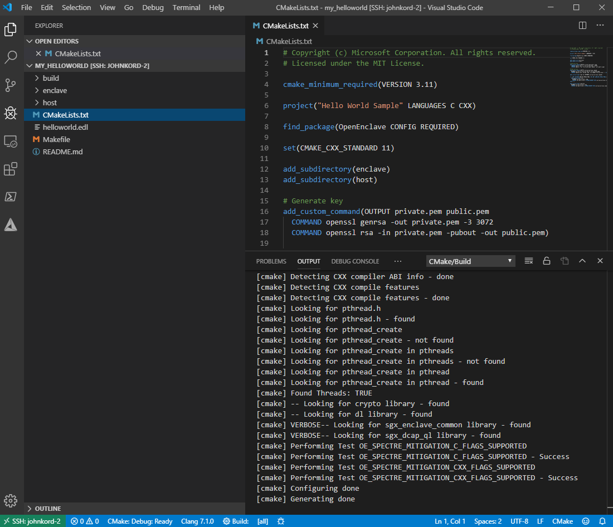
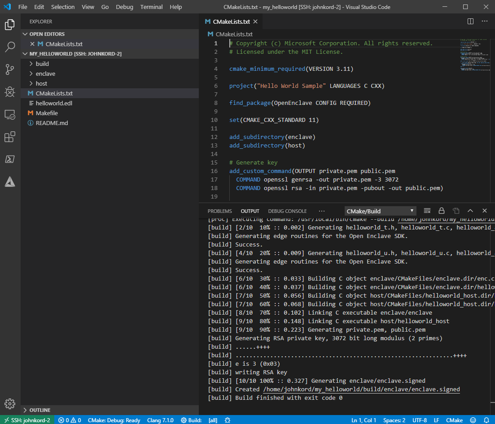
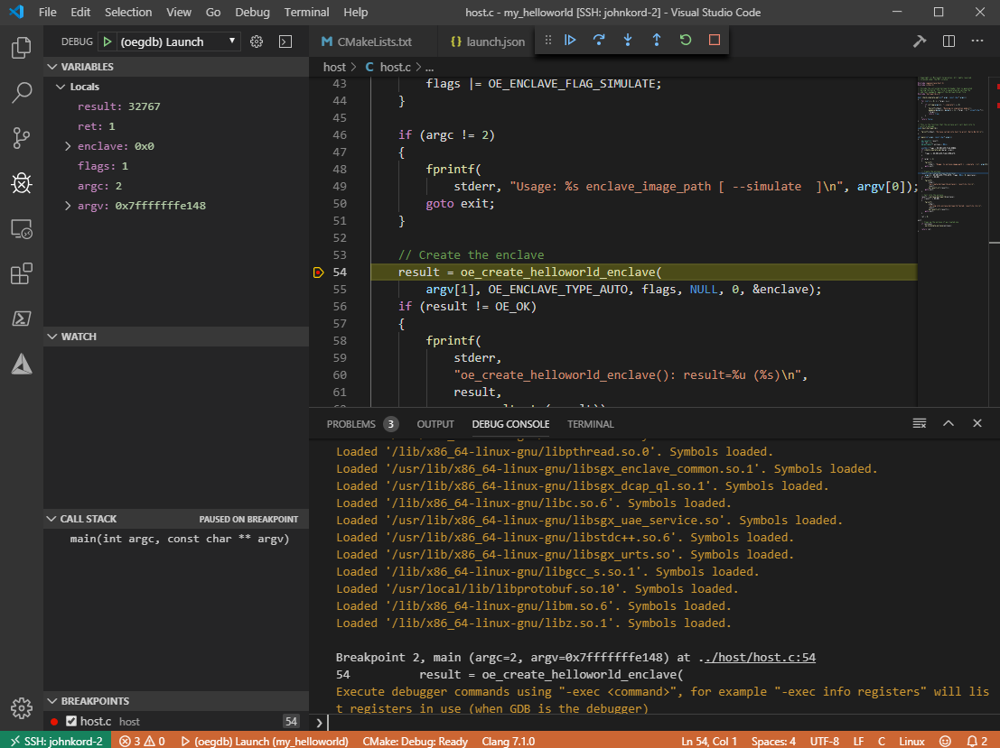
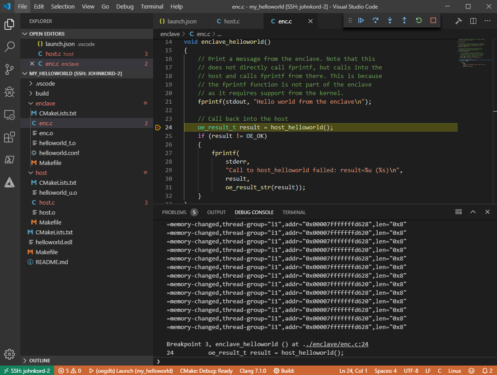

# Building And Debugging Using Visual Studio Code for Linux Development

This document provides a brief overview of how to build and debug Open Enclave applications using VS Code on Linux.

## Where to Run VS Code?

There are two ways of running VS Code for development on Linux.
1. Run VS Code directly on your Linux system, which will give you a native Linux display of VS Code.
2. Run VS Code from any modern Windows system and use the `Remote SSH` extension in VS Code to connect to a Linux system you wish to develop on.
  a. For more information on how to use the `Remote SSH` extension, please follow this blog post here: [https://code.visualstudio.com/blogs/2019/07/25/remote-ssh](https://code.visualstudio.com/blogs/2019/07/25/remote-ssh)

## Install VS Code

The latest version of Visual Studio Code can be installed from [https://code.visualstudio.com/](https://code.visualstudio.com/)

## Install VS Code Extensions

Install the following VS Code extensions. If you are using the Remote SSH, ensure they are installed remotely too by clicking  Click on an image to navigate to the Visual Studio Code Marketplace page for the extension.

[](https://marketplace.visualstudio.com/items?itemName=ms-vscode.cpptools)

[](https://marketplace.visualstudio.com/items?itemName=twxs.cmake)

[](https://marketplace.visualstudio.com/items?itemName=vector-of-bool.cmake-tools)


## Launch Visual Studio Code

If you want to run VS Code directly on your Linux system, simply run `code MY_WORKSPACE`, replacing "MY_WORKSPACE" with the path to your development directory.

If you want to run VS Code from Windows and connect to your Linux system with the `Remote SSH` extension, simply start VS Code on your Windows system, probably from the start menu. Then at the bottom left of the VS Code window, there should be a small icon that looks like a greater-then and less-than sign . You should click that icon and then select in the menu bar `Remote-SSH: Connect to Host...`. You should then be able to connect using SSH to your Linux development system. You can then use VS Code from your Windows system mostly as if you were using it natively on Linux. Please refer to the blog linked above for more details!

## Configure Your Workspace

1. Ensure all of your dependencies for building an Open Enclave SDK application are installed on your Linux system. You can achieve that by following these instructions: [https://github.com/openenclave/openenclave#getting-started](https://github.com/openenclave/openenclave#getting-started)

2. As an example, on your Linux system, copy one of the samples to your local directory. We will choose the helloworld sample for simplicity.

```bash
cp -R /opt/openenclave/share/openenclave/samples/helloworld ~/my_helloworld
```

3. In VS Code, select `File->Open Folder...` and specify the location that you copied the helloworld sample to. In this case, that would be `~/my_helloworld`

4. Create a typical VSCode project Settings.json file in this path for your project: .vscode/Settings.json. Make sure the `-DOpenEnclave_Dir` option is set to /opt/openenclave/lib/openenclave/cmake under the "cmake.configureArgs" field, like below:

```json
{
    "cmake.configureArgs": [
        "-DOpenEnclave_DIR=/opt/openenclave/lib/openenclave/cmake"
    ]
}
```

5. Use the shortcut `Ctrl-Shift-P` and select `CMake: Configure` and then select the kit which you want to configure with. You should probably select Clang-7*, but other options may work too.



## Build And Run Your Open Enclave Application

Build the application by pressing Shift+F7 or typing "CMake Build a target" in the command palette, and selecting the "all META" target.



Run your application by pressing Shift+F7 or typing "CMake Build a target" in the command palette, and selecting the "run UTILITY" target.


## Configuring Intellisense

Intellisense should work out of the box for files within your workspace. However, Intellisense may not be aware of where to locate the Open Enclave SDK headers.
Open settings.json under the .vscode folder and add entries for "C_Cpp.default.includePath" and "C_Cpp.default.systemIncludePath".

```json
{
    "C_Cpp.default.includePath": ["/opt/openenclave/include"],
    "C_Cpp.default.systemIncludePath": [
        "/opt/openenclave/include/openenclave/3rdparty/libc",
        "/opt/openenclave/include/openenclave/3rdparty/libcxx"
    ]
}
```

## Debug Your Open Enclave Application

You will want to use the oegdb script provided in /opt/openenclave/bin/oegdb for the debugger, by setting the `miDebuggerPath` field to /opt/openenclave/bin/oegdb in launch.json.

The rest of the fields for this configuration can be typical gdb debugging values.

Here is an example of launch.json after editing it for the helloworld enclave.

```json
{
    "version": "0.2.0",
    "configurations": [
        {
            "name": "(oegdb) Launch",
            "type": "cppdbg",
            "request": "launch",
            "program": "${workspaceFolder}/build/host/helloworld_host",
            "args": ["${workspaceFolder}/build/enclave/enclave.signed"],
            "stopAtEntry": false,
            "cwd": "${workspaceFolder}",
            "environment": [],
            "externalConsole": false,
            "MIMode": "gdb",
            "miDebuggerPath": "/opt/openenclave/bin/oegdb",
            "setupCommands": [
                {
                    "description": "Enable pretty-printing for gdb",
                    "text": "-enable-pretty-printing",
                    "ignoreFailures": true
                }
            ]
        }
    ]
}
```

Open host.c and add a breakpoint. Start debugging.



Step over the line that creates the enclave. The Console pane should show that the enclave has been loaded.


Open enc.c and put a breakpoint and continue execution.


